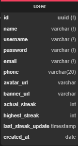
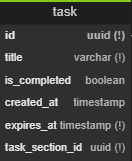
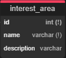

# Atividade final Banco de Dados 2025.1
### Nicollas Matheus Prado Pinheiro
### PDS WEB - BRAINZ

<hr>

## Diagrama Relacional Completo


## Tabelas escolhidas





## Comandos
Create:
```sql
a
```